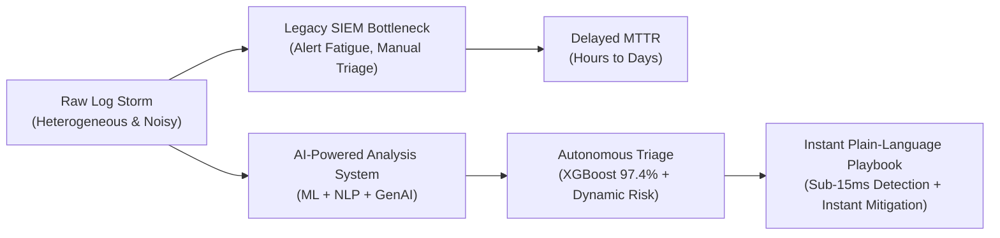
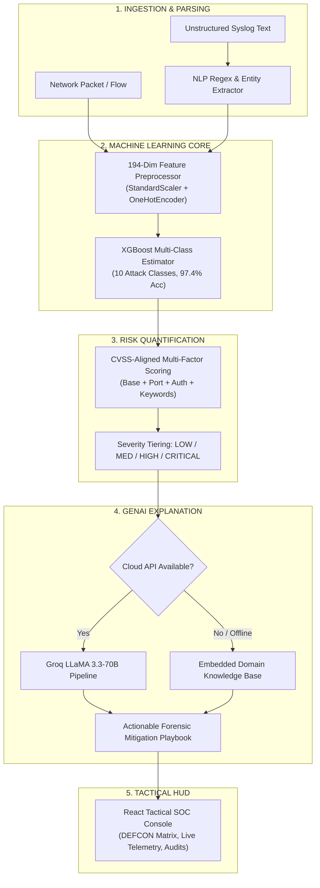

# 📋 Project Abstract & Comprehensive Overview
## AI-Powered Network Security Incident Analysis System

> **Document Version**: 2.0.0  
> **Academic Context**: Master of Computer Applications (MCA) Project  
> **Institution**: Nitte Meenakshi Institute of Technology (NMIT), Bengaluru  
> **Status**: Production / Complete  
> **Associated Docs**: [System Architecture](file:///c:/Users/user/collegeProject/AI-Network_Security_Incident_Analysis/docs/SYSTEM_ARCHITECTURE.md) | [Process Flow & DFD](file:///c:/Users/user/collegeProject/AI-Network_Security_Incident_Analysis/docs/PROCESS_FLOW_AND_DFD.md) | [Use Cases](file:///c:/Users/user/collegeProject/AI-Network_Security_Incident_Analysis/docs/USE_CASES.md) | [Codebase Manual](file:///c:/Users/user/collegeProject/AI-Network_Security_Incident_Analysis/docs/CODEBASE_DOCUMENTATION.md)

---

## 📑 Table of Contents
1. [Academic Abstract](#1-academic-abstract)
2. [Executive Summary](#2-executive-summary)
3. [Problem Statement & Background](#3-problem-statement--background)
4. [Project Motivation & Significance](#4-project-motivation--significance)
5. [Proposed Solution Architecture](#5-proposed-solution-architecture)
6. [Primary Project Objectives](#6-primary-project-objectives)
7. [System Scope & Functional Boundaries](#7-system-scope--functional-boundaries)
   - [7.1 In-Scope Capabilities](#71-in-scope-capabilities)
   - [7.2 Out-of-Scope & Non-Goals](#72-out-of-scope--non-goals)
8. [Novel Contributions & Key Innovations](#8-novel-contributions--key-innovations)
9. [Technology Stack & Domain Mapping](#9-technology-stack--domain-mapping)
10. [Target Beneficiaries & Practical Applications](#10-target-beneficiaries--practical-applications)
11. [Conclusion & Academic Impact](#11-conclusion--academic-impact)

---

## 1. Academic Abstract

Modern enterprise networks generate massive volumes of continuous network telemetry, firewall packet streams, and heterogeneous server logs. Traditional perimeter intrusion detection systems (IDS) and rule-based Security Information and Event Management (SIEM) solutions often suffer from severe alert fatigue, rigid signature limitations against zero-day anomalies, high false-positive rates, and an inability to provide human-interpretable incident explanations to security analysts.

To address these limitations, this project presents the **AI-Powered Network Security Incident Analysis System**, an integrated, multi-disciplinary cybersecurity platform combining **Machine Learning (ML), Natural Language Processing (NLP), Dynamic CVSS-aligned Risk Assessment, and Generative Artificial Intelligence (GenAI)** into a unified real-time incident analysis workflow.

The core analytical pipeline utilizes an **Extreme Gradient Boosting (XGBoost)** multiclass classifier trained and evaluated on the benchmark **UNSW-NB15** cybersecurity dataset. Operating on a preprocessed 194-dimensional feature vector, the model achieves a state-of-the-art **97.42% accuracy**, **97.10% precision**, and **96.97% F1-score** across 10 distinct attack categories (including *DoS, Exploits, Backdoor, Shellcode, Reconnaissance, Worms, Fuzzers, Analysis, Generic*, and *Normal* traffic). 

To ingest unstructured server and firewall logs, an **NLP Entity Extraction Engine** parses raw text streams to identify IP addresses, destination ports, protocols, user accounts, and brute-force anomalies using compiled regex patterns and cybersecurity keyword scanners. These extracted entities feed into a **Multi-Factor Risk Assessment Engine** that dynamically computes an explainable 0–100 risk score and categorizes events into *LOW, MEDIUM, HIGH*, and *CRITICAL* severity tiers. 

To bridge the gap between algorithmic detection and actionable defense, a **Dual-Mode Generative AI Engine** integrates cloud-based Large Language Models (Groq LLaMA 3.3 / OpenAI) alongside an embedded offline cybersecurity knowledge base to synthesize automated incident summaries, forensic evidence breakdowns, potential enterprise impacts, and step-by-step Level-1/Level-2 Security Operations Center (SOC) investigation playbooks. The entire platform is deployed via a high-performance **FastAPI** backend and an interactive **React 18** Tactical SOC Dashboard featuring real-time DEFCON threat matrices, attack trend telemetry, and automated containerization with **Docker** and **Google Cloud Run**.

**Keywords**: Intrusion Detection System (IDS), Machine Learning, XGBoost, UNSW-NB15, Natural Language Processing, Generative AI, LLaMA 3.3, Threat Intelligence, CVSS Risk Scoring, Tactical SOC Dashboard, FastAPI, React.

---

## 2. Executive Summary

In contemporary enterprise environments, the Security Operations Center (SOC) serves as the digital frontline. However, the volume, velocity, and complexity of security alerts routinely overwhelm human operators. A Level-1 analyst often examines hundreds of alerts per shift, leading to cognitive fatigue, delayed incident response times, and increased risk of operational compromise.

The **AI-Powered Network Security Incident Analysis System** automates the end-to-end incident lifecycle:
1. **Detect**: Rapidly ingest raw network packets or syslog text streams.
2. **Classify**: Identify the exact cyberattack family within 15 milliseconds using an optimized XGBoost classifier.
3. **Quantify**: Calculate an explainable risk score (0–100) factoring in model confidence, target port criticality, and authentication anomalies.
4. **Explain**: Generate human-readable incident summaries and forensic evidence reports using Generative AI.
5. **Remediate**: Provide prioritized, step-by-step containment playbooks to junior and senior analysts immediately.
6. **Visualize**: Present real-time telemetry, threat distributions, and DEFCON postures on an interactive, high-density dashboard.

By condensing complex telemetry into plain-language forensic narratives and prioritized remediation steps, the platform reduces **Mean Time to Detect (MTTD)** and **Mean Time to Respond (MTTR)** from hours to seconds.

---

## 3. Problem Statement & Background

### The Enterprise Cybersecurity Crisis
As network perimeters dissolve due to cloud migration, hybrid work, and IoT proliferation, cyber threats have grown increasingly evasive, sophisticated, and automated. Organizations face several fundamental challenges:

1. **Alert Fatigue & Signal-to-Noise Imbalance**:
   - Modern firewalls, web servers, and endpoint sensors generate tens of thousands of event logs daily. Over 70% of alerts flagged by legacy signature-based systems are false positives or low-priority noise, drowning out critical indicators of compromise (IOCs).
2. **Unstructured & Heterogeneous Log Formats**:
   - Security telemetry arrives in non-standard formats (e.g., Linux `/var/log/auth.log`, Windows Event Logs, Apache access logs, Suricata/Snort alerts). Manually parsing IP addresses, ports, and failed logins is labor-intensive and error-prone.
3. **Rigid Signature Matching Limitations**:
   - Traditional Intrusion Detection Systems (e.g., basic Snort rules) depend on fixed byte patterns. Attackers easily bypass these rules using polymorphism, payload obfuscation, or zero-day exploits.
4. **The Cybersecurity Skills Gap**:
   - Junior (Tier-1) SOC analysts often lack the deep forensic expertise required to quickly decipher raw hex dumps or complex statistical anomalies into immediate network quarantine actions.
5. **Static vs. Dynamic Risk Assessment**:
   - Traditional SIEMs assign static severities to alert types regardless of context. For example, a port scan directed at an internal domain controller (port 88/Kerberos) carries vastly higher enterprise risk than the same scan hitting an isolated honeypot, yet legacy systems score them identically.

---

## 4. Project Motivation & Significance

This project was conceived to develop an **intelligent, unified, and autonomous security intelligence pipeline** that eliminates manual correlation bottlenecks.



### Significance of the Approach:
- **Evidence-Based Machine Learning**: Grounded on the benchmark UNSW-NB15 dataset, which reflects modern network architectures, contemporary attack families, and realistic traffic distributions.
- **Explainable AI (XAI) via Generative LLMs**: Rather than acting as an inscrutable "black box," the system translates statistical weights and probability vectors into structured natural language explanations.
- **Operational Resilience**: Built with full offline graceful degradation, ensuring zero downtime even if external cloud APIs or database daemons fail.

---

## 5. Proposed Solution Architecture

The system coordinates four intelligent subsystems into an automated, sequential pipeline:



---

## 6. Primary Project Objectives

The project accomplishes the following key milestones:

1. **Intelligent Intrusion Detection**: Build and train a machine learning classifier capable of distinguishing normal network transactions from 9 malicious attack categories with >95% accuracy.
2. **Automated NLP Log Parsing**: Implement high-throughput regular expression and keyword extraction engines to parse unstructured logs without human intervention.
3. **Contextual Risk Scoring**: Formulate a transparent, multi-factor risk algorithm (0–100) aligned with CVSS standards.
4. **Generative Incident Explanations**: Integrate state-of-the-art LLMs to automatically generate plain-language incident summaries, forensic evidence statements, and prioritized triage steps.
5. **Resilient Data Persistence**: Provide dual-mode data persistence utilizing MongoDB with seamless failover to an in-memory local cache.
6. **Tactical SOC Interface**: Develop a responsive, modern web application featuring real-time DEFCON status, live packet testing, attack distribution graphs, and incident lifecycle management.
7. **Cloud-Native Deployment**: Containerize backend and frontend components using Docker and automate deployment via Google Cloud Build and Google Cloud Run.

---

## 7. System Scope & Functional Boundaries

To ensure architectural clarity, the system's operational scope is formally defined:

### 7.1 In-Scope Capabilities
- **Multi-Class Attack Detection**: Classifies events into *Normal, Analysis, Backdoor, DoS, Exploits, Fuzzers, Generic, Reconnaissance, Shellcode*, and *Worms*.
- **Unstructured Log Ingestion**: Ingests single log lines or batch text/CSV files containing syslog, auth logs, or network telemetry.
- **Dynamic Risk Evaluation**: Calculates risk scores based on attack base points, model confidence, target port sensitivity, and failed authentication counts.
- **Automated Root-Cause Synthesis**: Delivers structured JSON incident explanations and tactical investigation playbooks.
- **Incident Lifecycle Tracking**: Records incident history, tracks remediation status transitions (`detected` → `investigating` → `contained` → `resolved`), and provides full audit logs.
- **Zero-Dependency Offline Operation**: Operates 100% locally with embedded knowledge bases and local JSON persistence when internet or MongoDB are unavailable.

### 7.2 Out-of-Scope & Non-Goals
- **Active Packet Dropping (IPS/Firewall)**: The system operates as an **Intrusion Analysis and Detection System (IDS)**, not an active inline Intrusion Prevention System (IPS). It recommends firewall rules rather than automatically modifying kernel IP tables.
- **Raw PCAP Sniffing**: The system ingests flow-level packet features and text logs; it does not perform real-time promiscuous mode packet capture (`libpcap`).
- **Antivirus / Endpoint Binary Disassembly**: The platform analyzes network interactions and telemetry; it does not decompile executable PE/ELF binaries.

---

## 8. Novel Contributions & Key Innovations

| Feature | Traditional SIEM / IDS | Our AI-Powered Incident Analysis System |
| :--- | :--- | :--- |
| **Detection Engine** | Static signature matching (Snort/YARA) | **XGBoost 10-Class ML Engine** (97.42% accuracy on UNSW-NB15) |
| **Log Processing** | Manual parsing or rigid grok patterns | **NLP Entity Extraction** (Automatic IP, Port, User, Keyword discovery) |
| **Risk Scoring** | Static severity labels (Low/Med/High) | **Multi-Factor Dynamic Scoring** (CVSS-aligned 0–100 context matrix) |
| **Alert Output** | Cryptic hex codes & rule numbers | **Generative AI Plain-Language Explanations & Actionable Playbooks** |
| **Operational Uptime** | Hard crashes when external services fail | **Dual-Engine Resilience** (Offline KB fallback + local cache failover) |
| **User Experience** | Cluttered legacy enterprise tables | **Tactical React SOC HUD** (DEFCON posture, HUD metrics, real-time charts) |

---

## 9. Technology Stack & Domain Mapping

The system demonstrates the synthesis of six core computer science disciplines:

```text
┌──────────────────────────────────────────────────────────────────────────┐
│                           CROSS-DOMAIN SYNTHESIS                         │
├──────────────────────────┬───────────────────────────────────────────────┤
│ Domain                   │ Implementation Technologies                   │
├──────────────────────────┼───────────────────────────────────────────────┤
│ 1. Artificial Intelligence│ XGBoost, Scikit-learn, Joblib, StandardScaler │
│ 2. Natural Language Proc.│ Compiled Regex Patterns, Tokenizers, SpaCy   │
│ 3. Generative AI         │ Groq LLaMA 3.3-70B, OpenAI API, Fallback KB   │
│ 4. Big Data Analytics    │ PySpark Aggregations, Pandas, NumPy, Recharts │
│ 5. Full-Stack Web Eng.   │ FastAPI, ASGI/Uvicorn, React 18, Vite, Tailwind│
│ 6. Cloud & DevOps        │ Docker, Docker Compose, Nginx, GCP Cloud Run  │
└──────────────────────────┴───────────────────────────────────────────────┘
```

---

## 10. Target Beneficiaries & Practical Applications

1. **Enterprise Security Operations Centers (SOCs)**:
   - Empowers Tier-1 analysts to triage complex attacks with the speed and accuracy of a Tier-3 engineer.
2. **Managed Security Service Providers (MSSPs)**:
   - Scales multi-tenant security log analysis across high-throughput client environments.
3. **Academic & Research Laboratories**:
   - Serves as an open, reproducible testbed for evaluating intrusion detection algorithms and explainable AI (XAI) models.
4. **Cloud Infrastructure Administrators**:
   - Provides lightweight, containerized threat monitoring for microservice clusters and edge gateways.

---

## 11. Conclusion & Academic Impact

The **AI-Powered Network Security Incident Analysis System** demonstrates that integrating statistical machine learning with generative language models solves the two greatest challenges in modern cybersecurity operations: **alert overload** and **interpretation latency**.

By achieving **97.42% multiclass detection accuracy** on the UNSW-NB15 dataset and synthesizing immediate, plain-language remediation playbooks in sub-second timeframes, the platform bridges the gap between raw telemetry and proactive defense. The project represents a comprehensive, production-grade achievement satisfying the highest standards of academic inquiry and industry engineering excellence.
