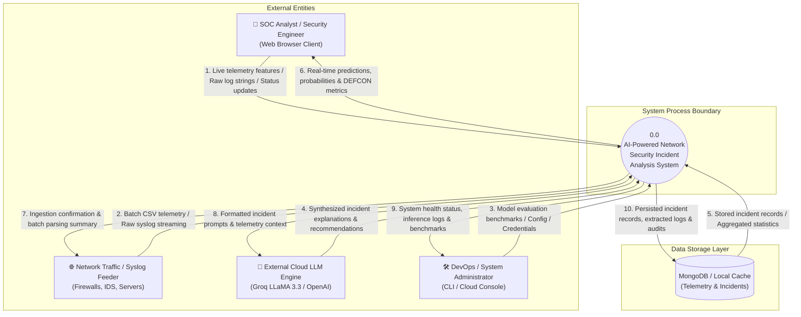
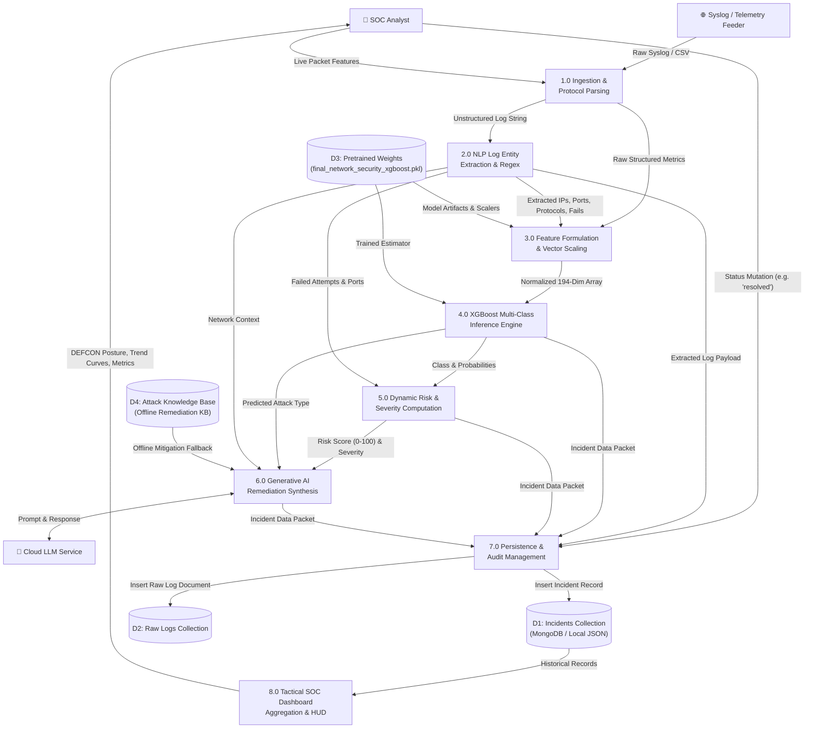
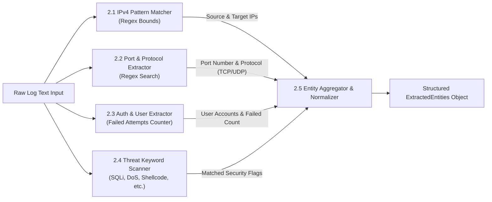
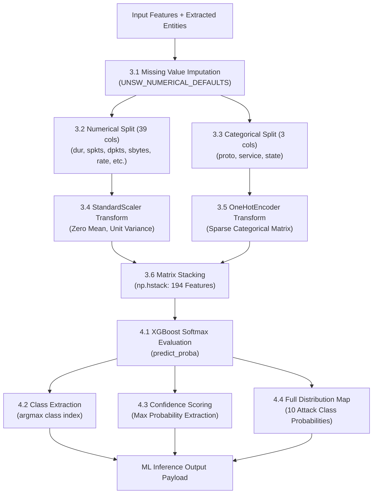
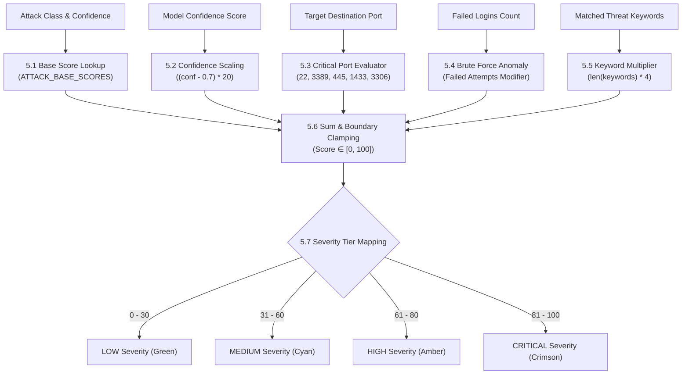
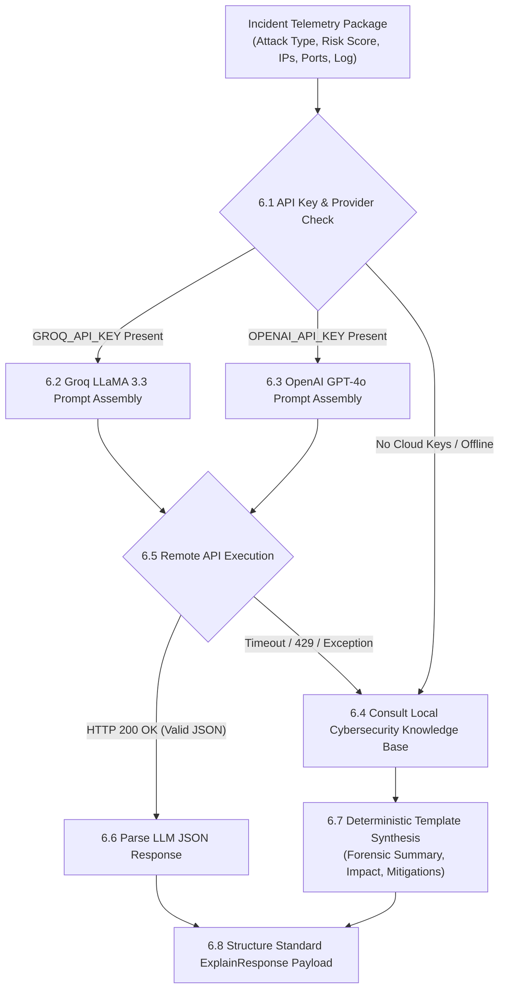
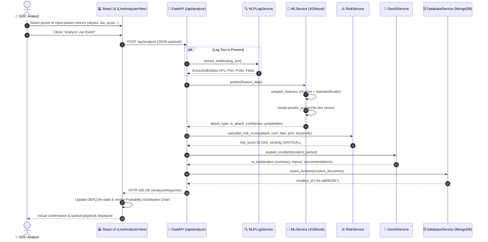
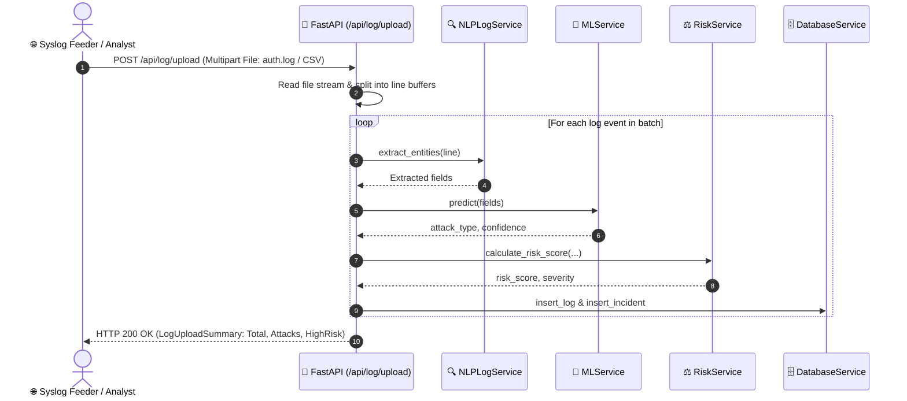
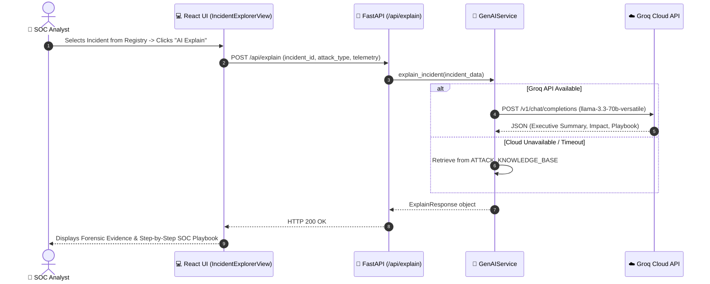
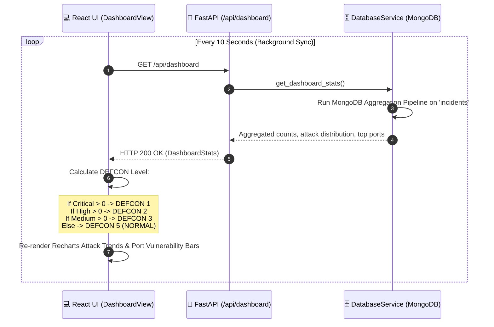

# 🔄 Process Flow & Data Flow Diagrams (DFD) Manual
## AI-Powered Network Security Incident Analysis System

> **Document Version**: 2.0.0  
> **Target Audience**: Systems Analysts, SOC Engineers, Software Architects, Academic Reviewers  
> **Status**: Production / Complete  
> **Applicable Standards**: Gane & Sarson / Yourdon & DeMarco DFD Standards, UML 2.5 Sequence Specifications

---

## 📑 Table of Contents
1. [Introduction & Diagramming Methodology](#1-introduction--diagramming-methodology)
2. [DFD Level 0: Context Diagram](#2-dfd-level-0-context-diagram)
3. [DFD Level 1: Subsystem Data Flow Diagram](#3-dfd-level-1-subsystem-data-flow-diagram)
4. [DFD Level 2: Detailed Process Decompositions](#4-dfd-level-2-detailed-process-decompositions)
   - [4.1 Process 2.0: NLP Entity Extraction & Keyword Matching](#41-process-20-nlp-entity-extraction--keyword-matching)
   - [4.2 Process 3.0 & 4.0: Feature Preprocessing & XGBoost Classification](#42-process-30--40-feature-preprocessing--xgboost-classification)
   - [4.3 Process 5.0: Dynamic CVSS-Aligned Risk Assessment](#43-process-50-dynamic-cvss-aligned-risk-assessment)
   - [4.4 Process 6.0: Generative AI Root-Cause & Playbook Generation](#44-process-60-generative-ai-root-cause--playbook-generation)
5. [End-to-End System Process Flows & Sequence Diagrams](#5-end-to-end-system-process-flows--sequence-diagrams)
   - [5.1 Sequence Diagram: Real-Time Live Network Telemetry Analysis](#51-sequence-diagram-real-time-live-network-telemetry-analysis)
   - [5.2 Sequence Diagram: Batch Syslog Upload & Ingestion Pipeline](#52-sequence-diagram-batch-syslog-upload--ingestion-pipeline)
   - [5.3 Sequence Diagram: On-Demand Incident Investigation & AI Playbook](#53-sequence-diagram-on-demand-incident-investigation--ai-playbook)
   - [5.4 Sequence Diagram: Executive Dashboard Aggregation & DEFCON Alerting](#54-sequence-diagram-executive-dashboard-aggregation--defcon-alerting)
6. [Data Dictionary & Data Flow Matrix](#6-data-dictionary--data-flow-matrix)

---

## 1. Introduction & Diagramming Methodology

This document details the **Data Flow Diagrams (DFDs)** and **System Process Flows** for the AI-Powered Network Security Incident Analysis System.

### Diagram Notational Conventions
In accordance with standard Gane & Sarson / Yourdon methodologies:
- **External Entities (Squares/Rectangles)**: External actors, network hardware, or third-party cloud services that produce or consume data (e.g., *SOC Analyst*, *Network Packet Feeder*, *Groq Cloud LLM*).
- **Processes (Rounded Boxes / Circles)**: Transformations, calculations, or algorithms applied to inbound data (e.g., *XGBoost Inference*, *Risk Scoring*).
- **Data Stores (Parallel Lines / Cylinders)**: Passive repositories of information (e.g., *MongoDB Incidents*, *Local JSON Cache*, *Pretrained Model Weights*).
- **Data Flows (Arrows)**: Named vectors showing the directional movement of structured information between entities, processes, and stores.

---

## 2. DFD Level 0: Context Diagram

The **Level 0 Context Diagram** models the entire application as a single high-level process boundary, detailing the external entities that interact with the system and the fundamental inputs and outputs exchanged.

---

## 3. DFD Level 1: Subsystem Data Flow Diagram

The **Level 1 DFD** decomposes the single root process into the 8 core operational sub-processes and maps their interactions with system data stores:

---

## 4. DFD Level 2: Detailed Process Decompositions

### 4.1 Process 2.0: NLP Entity Extraction & Keyword Matching
This process breaks down unstructured text streams into normalized forensic entities.

### 4.2 Process 3.0 & 4.0: Feature Preprocessing & XGBoost Classification
Transforms raw attributes into a 194-dimensional matrix aligned with UNSW-NB15 and runs XGBoost classification.

### 4.3 Process 5.0: Dynamic CVSS-Aligned Risk Assessment
Calculates an explainable 0–100 risk score and maps to tactical severity bands.

### 4.4 Process 6.0: Generative AI Root-Cause & Playbook Generation
Provides dual-mode contextual explanation of the incident.

---

## 5. End-to-End System Process Flows & Sequence Diagrams

### 5.1 Sequence Diagram: Real-Time Live Network Telemetry Analysis
Demonstrates what occurs when a SOC Analyst inputs packet telemetry into the **Live Event Analyzer**:

---

### 5.2 Sequence Diagram: Batch Syslog Upload & Ingestion Pipeline
Demonstrates how bulk log files (auth logs, firewall CSVs) are digested:

---

### 5.3 Sequence Diagram: On-Demand Incident Investigation & AI Playbook
Demonstrates an analyst opening an incident from the registry to request a tailored remediation plan:

---

### 5.4 Sequence Diagram: Executive Dashboard Aggregation & DEFCON Alerting
Demonstrates background polling and real-time posture synchronization:

---

## 6. Data Dictionary & Data Flow Matrix

| Data Flow Name | Originating Subsystem | Destination Subsystem | Data Structure / Schema | Description |
| :--- | :--- | :--- | :--- | :--- |
| **`AnalyzeRequest`** | Frontend Client | `/api/analyze` | Pydantic `AnalyzeRequest` | Contains packet metrics (`dur`, `sbytes`, `proto`) or raw `log_text`. |
| **`ExtractedEntities`** | `NLPLogService` | Route Handler | Pydantic `ExtractedEntities` | Structured IPs, destination port, protocol, username, and failed attempts. |
| **`FeatureMatrix (194-d)`** | `MLService` | XGBoost Model | `np.ndarray (1, 194)` | Preprocessed, scaled, and one-hot encoded numeric vector. |
| **`MLPrediction`** | XGBoost Estimator | Route Handler | `Tuple[str, bool, float, dict]` | Predicted attack label, binary flag, confidence float, and 10-class probability map. |
| **`RiskAssessment`** | `RiskService` | Route Handler | `Tuple[int, str]` | Integer risk score (0–100) and severity band (`LOW`, `MEDIUM`, `HIGH`, `CRITICAL`). |
| **`ExplainResponse`** | `GenAIService` | Frontend Client | Pydantic `ExplainResponse` | Incident summary, forensic evidence, impact assessment, and investigation steps. |
| **`DashboardStats`** | `DatabaseService` | Frontend Client | Pydantic `DashboardStats` | Overview counts, attack distribution breakdown, temporal trends, and top ports. |
