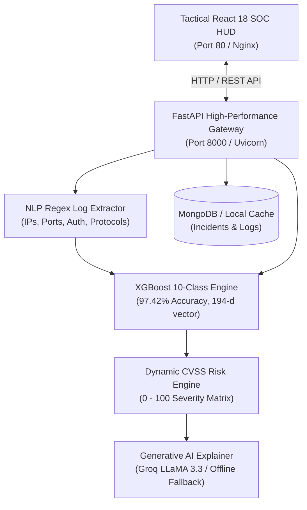

# 📖 AI-Powered Network Security Incident Analysis System
# 📂 Documentation Suite & Technical Knowledge Base

Welcome to the centralized engineering documentation directory for the **AI-Powered Network Security Incident Analysis System**.

This repository contains comprehensive architectural blueprints, data flow diagrams (DFD), system process flows, use case analyses, and a complete code-level technical manual.

---

## 📑 Documentation Catalog

| Document | File Link | Focus Area & Description | Key Diagrams Included |
| :--- | :--- | :--- | :--- |
| **📋 Abstract & Overview** | [**`ABSTRACT_AND_OVERVIEW.md`**](file:///c:/Users/user/collegeProject/AI-Network_Security_Incident_Analysis/docs/ABSTRACT_AND_OVERVIEW.md) | Formal academic abstract, executive summary, problem statement, project scope, novel contributions, domain mapping, and target beneficiaries. | End-to-End Pipeline Summary, Solution Architecture Flow, SIEM vs AI System Comparison. |
| **🏗️ System Architecture** | [**`SYSTEM_ARCHITECTURE.md`**](file:///c:/Users/user/collegeProject/AI-Network_Security_Incident_Analysis/docs/SYSTEM_ARCHITECTURE.md) | Multi-tier architectural topology, presentation layer, FastAPI core, ML pipeline, storage engines, containerization, cloud deployment, and security hardening. | High-Level Topology, Multi-Tier Flow, Component Class Diagram, Preprocessing Pipeline, Docker & Cloud Run Diagram, Resilience Fallback Map. |
| **🔄 Process Flow & DFD** | [**`PROCESS_FLOW_AND_DFD.md`**](file:///c:/Users/user/collegeProject/AI-Network_Security_Incident_Analysis/docs/PROCESS_FLOW_AND_DFD.md) | Detailed Data Flow Diagrams (DFD Level 0, Level 1, Level 2) and UML sequence diagrams modeling real-time packet analysis, batch syslog parsing, and AI explanation flows. | DFD Level 0 (Context), DFD Level 1 (Subsystems), DFD Level 2 (Decompositions), 4 UML Sequence Diagrams, Data Flow Matrix. |
| **🎯 Use Case Analysis** | [**`USE_CASES.md`**](file:///c:/Users/user/collegeProject/AI-Network_Security_Incident_Analysis/docs/USE_CASES.md) | Comprehensive stakeholder personas (Tier-1 SOC, Threat Hunter, CISO, DevOps), master UML Use Case Diagram, and formal specifications for all 8 core platform use cases. | Master UML Use Case Diagram, Preconditions/Triggers/Flows for UC-01 through UC-08, Traceability Matrix. |
| **📚 Codebase Manual** | [**`CODEBASE_DOCUMENTATION.md`**](file:///c:/Users/user/collegeProject/AI-Network_Security_Incident_Analysis/docs/CODEBASE_DOCUMENTATION.md) | Exhaustive component-by-component source code reference covering every service, route handler, Pydantic model, React view, script, and Docker configuration ("What It Does & What It Does NOT Do"). | Lifecycles, Service Signatures, API Schemas, Frontend Views, Seeding Scripts, CI/CD Workflows. |

---

## 🗺️ Architectural Summary at a Glance

---

## ⚡ Quick Navigation Links
- [View Project Abstract & Comprehensive Overview](file:///c:/Users/user/collegeProject/AI-Network_Security_Incident_Analysis/docs/ABSTRACT_AND_OVERVIEW.md)
- [View System Architecture](file:///c:/Users/user/collegeProject/AI-Network_Security_Incident_Analysis/docs/SYSTEM_ARCHITECTURE.md)
- [View Process Flows & Data Flow Diagrams](file:///c:/Users/user/collegeProject/AI-Network_Security_Incident_Analysis/docs/PROCESS_FLOW_AND_DFD.md)
- [View Use Case Specifications](file:///c:/Users/user/collegeProject/AI-Network_Security_Incident_Analysis/docs/USE_CASES.md)
- [View Full Codebase Documentation](file:///c:/Users/user/collegeProject/AI-Network_Security_Incident_Analysis/docs/CODEBASE_DOCUMENTATION.md)
- [Return to Project README](file:///c:/Users/user/collegeProject/AI-Network_Security_Incident_Analysis/README.md)
