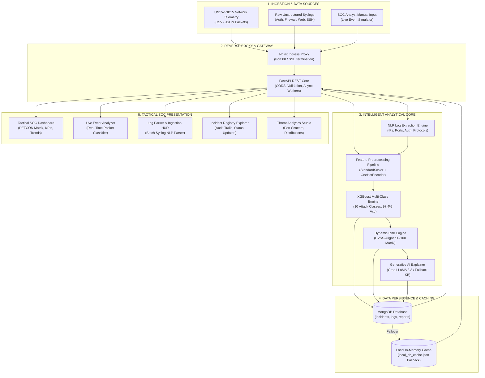
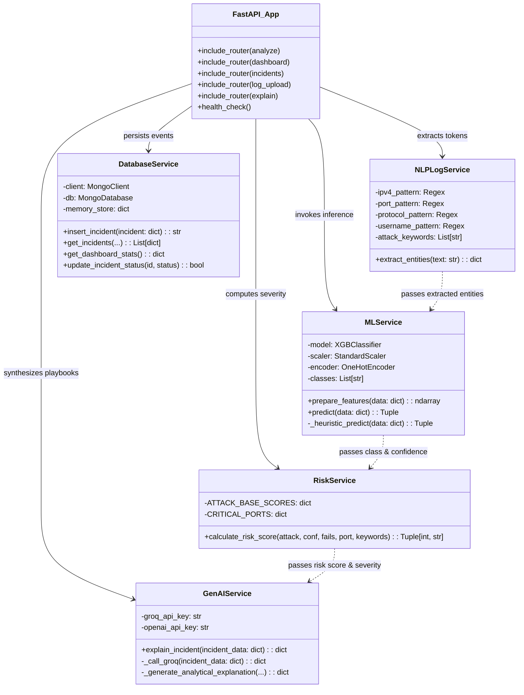
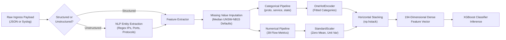
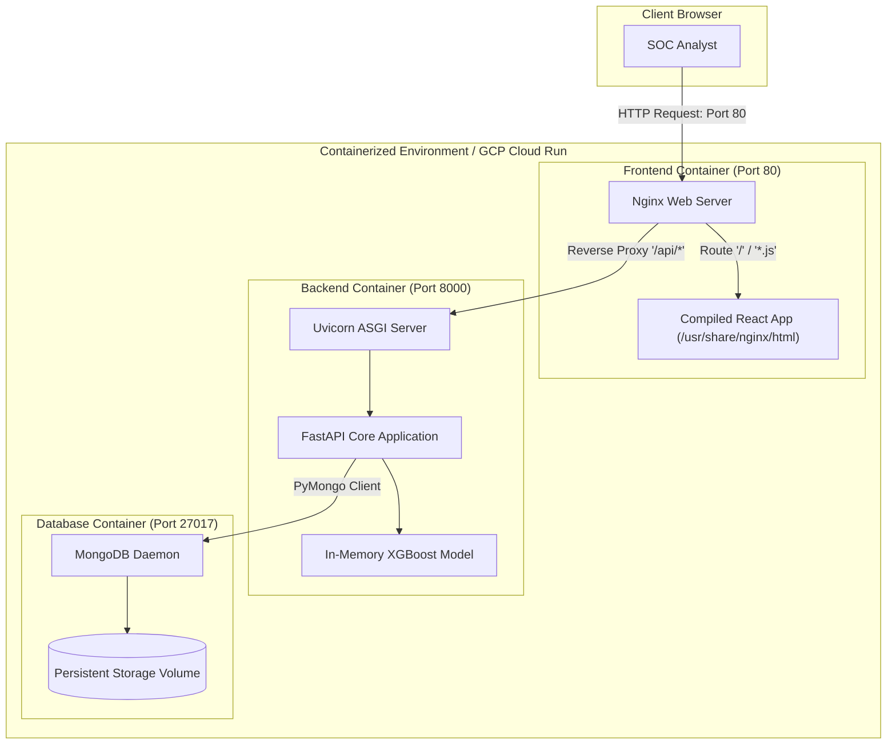

# 🏗️ System Architecture & Engineering Specifications
## AI-Powered Network Security Incident Analysis System

> **Document Version**: 2.0.0  
> **Target Audience**: Security Architects, SOC Engineers, Software Developers, Academic Evaluators  
> **Status**: Production / Complete  
> **Associated Repositories**: Backend (FastAPI), Frontend (React 18), ML Pipeline (XGBoost, PySpark)

---

## 📑 Table of Contents
1. [Executive Architectural Overview](#1-executive-architectural-overview)
2. [High-Level Architectural Topology](#2-high-level-architectural-topology)
3. [Multi-Tier System Architecture](#3-multi-tier-system-architecture)
   - [3.1 Presentation Tier (React Tactical SOC HUD)](#31-presentation-tier-react-tactical-soc-hud)
   - [3.2 Application & API Gateway Tier (FastAPI)](#32-application--api-gateway-tier-fastapi)
   - [3.3 Analytical & Machine Learning Engine Tier](#33-analytical--machine-learning-engine-tier)
   - [3.4 Generative AI & Knowledge Synthesis Tier](#34-generative-ai--knowledge-synthesis-tier)
   - [3.5 Data Persistence & Storage Tier](#35-data-persistence--storage-tier)
4. [Component-Level Architecture](#4-component-level-architecture)
5. [Data Preprocessing & Feature Engineering Pipeline](#5-data-preprocessing--feature-engineering-pipeline)
6. [Machine Learning Specifications & Performance](#6-machine-learning-specifications--performance)
7. [Cloud, Containerization & Infrastructure Architecture](#7-cloud-containerization--infrastructure-architecture)
8. [Resilience, Fault-Tolerance & Graceful Degradation](#8-resilience-fault-tolerance--graceful-degradation)
9. [Security Architecture & Defensive Hardening](#9-security-architecture--defensive-hardening)
10. [Hardware, System & Network Requirements](#10-hardware-system--network-requirements)

---

## 1. Executive Architectural Overview

The **AI-Powered Network Security Incident Analysis System** is an enterprise-grade cybersecurity analysis platform built to process, classify, contextualize, and remediate high-throughput network telemetry and unstructured server logs.

Traditional Security Information and Event Management (SIEM) systems generate overwhelming alert volumes ("alert fatigue") and require tedious manual correlation by Level-1 Security Operations Center (SOC) analysts. This system solves that problem by integrating:
- **High-Performance Machine Learning**: Multiclass XGBoost trained on the UNSW-NB15 dataset (97.42% accuracy, 10 distinct attack categories).
- **Natural Language Processing (NLP)**: Fast regex and tokenization engines that extract IP addresses, ports, protocols, user accounts, and attack indicators from unstructured log strings.
- **Dynamic CVSS-Aligned Risk Scoring**: A multi-factor mathematical risk engine that evaluates attack baseline severity, model confidence, repeated authentication failures, and critical destination ports.
- **Generative AI Root-Cause & Playbook Synthesis**: Dual-mode engine that utilizes external Large Language Models (Groq LLaMA 3.3 / OpenAI) when online, backed by an offline cybersecurity knowledge base that guarantees zero downtime.
- **Modern Tactical SOC Dashboard**: Built with React 18, Tailwind CSS, Lucide icons, and Recharts, providing real-time telemetry visualizers, DEFCON threat indicators, and incident investigation workflows.

---

## 2. High-Level Architectural Topology

The following diagram illustrates the end-to-end data ingestion, inference, synthesis, and presentation flow across the entire platform:



---

## 3. Multi-Tier System Architecture

The application adopts a decoupled, multi-tier micro-service pattern designed for horizontal scalability, zero-downtime failover, and loose coupling.

### 3.1 Presentation Tier (React Tactical SOC HUD)
The presentation layer is implemented as a single-page application (SPA) running React 18, bundled with Vite for ultra-fast Hot Module Replacement (HMR) and optimized production minification.

- **Design Philosophy**: High-density cybersecurity console aesthetic utilizing deep slate backgrounds (`#0a0f1d`), neon cyan (`#00f0ff`), emerald green (`#10b981`), amber warning tones, and crimson alert accents.
- **Component Hierarchy**:
  - `App.jsx`: Global application state manager, navigation bar, active tab router, DEFCON system alert banner, and toast notification center.
  - `DashboardView.jsx`: High-level executive SOC dashboard featuring DEFCON posture, key threat metrics (total events, detected attacks, critical incidents), attack trend timeline, port risk distribution, and live incident stream.
  - `LiveAnalyzerView.jsx`: Interactive packet analyzer featuring preloaded attack presets (DDoS SYN Flood, SSH Brute Force, Shellcode Injection, Worm Outbreak, SQL Injection, Benign HTTP), real-time feature form, and XGBoost probability distribution chart.
  - `LogParserView.jsx`: Raw unstructured syslog ingestion console featuring real-time NLP entity extraction badges, keyword highlights, and direct automated pipeline submission.
  - `IncidentExplorerView.jsx`: Filterable, searchable SOC registry displaying past incidents, severity badges, investigation status tags, and detailed forensic drill-down modals.
  - `AnalyticsView.jsx`: Deep-dive data visualization studio rendering macro attack distribution, port vulnerability frequencies, and protocol breakdowns.
  - `ArchitectureView.jsx`: In-app system architecture and machine learning evaluation specifications.

### 3.2 Application & API Gateway Tier (FastAPI)
The API layer is built on **FastAPI (Python 3.10+)**, utilizing ASGI asynchronous event loops powered by Uvicorn.

- **Routing Architecture**:
  - `/api/analyze` (`routes/analyze.py`): Ingests both structured packet features and unstructured raw strings, orchestrating NLP extraction, ML vectorization, risk calculation, GenAI explanation, and database persistence in a single request lifecycle.
  - `/api/log/upload` (`routes/log_upload.py`): Handles bulk ingestion of plaintext logs, JSON records, or batch CSV uploads.
  - `/api/dashboard` (`routes/dashboard.py`): Aggregates historical telemetry into real-time executive statistics, temporal attack trends, and top attacked ports.
  - `/api/incidents` (`routes/incidents.py`): Provides paginated, filterable querying of recorded security incidents, as well as status transition mutations (`detected` → `investigating` → `contained` → `resolved`).
  - `/api/explain` (`routes/explain.py`): Independent endpoint for on-demand Generative AI root-cause analysis and investigation recommendation synthesis.
- **Data Validation**: Strict Pydantic models (`backend/models/schemas.py`) enforce type safety, bounds checking, and default fallback parameters on every ingress and egress payload.
- **Middleware**: Asynchronous Cross-Origin Resource Sharing (CORS) middleware configured to securely handle cross-origin browser communication.

### 3.3 Analytical & Machine Learning Engine Tier
The analytics layer encapsulates feature preprocessing and model inference.

- **Pipeline Artifact (`final_network_security_xgboost.pkl`)**:
  - Serialized dictionary containing the trained `XGBoostClassifier`, scikit-learn `OneHotEncoder` (handling categorical fields: `proto`, `service`, `state`), `StandardScaler` (normalizing 39 continuous numeric features), and `LabelEncoder` (10 attack classes).
- **Feature Space Transformation**:
  - Translates arbitrary inbound payloads into a uniform 194-dimensional sparse-dense feature matrix.
  - Missing numeric parameters are imputed using median statistical defaults computed from the UNSW-NB15 training distribution.
- **Inference Performance**:
  - Sub-15 millisecond prediction latency per event on standard CPU hardware.
  - Outputs both the discrete predicted class label and a normalized probability distribution across all 10 attack categories.

### 3.4 Generative AI & Knowledge Synthesis Tier
The GenAI module bridges the gap between raw statistical machine learning probabilities and human-actionable SOC incident response.

- **Primary Provider (Cloud LLM)**:
  - Connects to the **Groq Cloud API** running ultra-fast inference on `llama-3.3-70b-versatile` (or OpenAI `gpt-4o-mini`).
  - Prompt engineering forces structured JSON output containing:
    1. Incident Executive Summary
    2. Corroborating Forensic Evidence
    3. Potential Operational Impact
    4. Actionable Step-by-Step Investigation Recommendations
- **Resilient Fallback (Domain-Specific Knowledge Base)**:
  - If external API keys are omitted, network access is restricted, or the cloud provider experiences rate limiting/downtime, the system automatically falls back to an embedded, deterministic cybersecurity knowledge base (`backend/services/genai_service.py:ATTACK_KNOWLEDGE_BASE`).
  - Guarantees 100% operational availability without external cloud dependencies.

### 3.5 Data Persistence & Storage Tier
The persistence tier provides dual-mode data storage.

- **Primary Storage (MongoDB)**:
  - Document-based database running on port 27017.
  - Collections:
    - `incidents`: Full incident records including extracted entities, ML classifications, risk scores, GenAI explanations, and lifecycle statuses.
    - `logs`: Raw ingested log files and telemetry events.
    - `predictions`: Model inference audit logs and probability vectors.
    - `analysis_reports`: Batch summary analytics and model evaluation reports.
- **Automated Fallback Storage (Local JSON Engine)**:
  - If the MongoDB daemon is offline or unreachable, the `DatabaseService` seamlessly shifts reads and writes to an in-memory collection backed by `backend/services/local_db_cache.json`.
  - Zero crashes occur when MongoDB is uninstalled or terminated during local development or offline grading.

---

## 4. Component-Level Architecture

The internal interactions between backend services, routers, and external dependencies are mapped below:



---

## 5. Data Preprocessing & Feature Engineering Pipeline

The system adheres strictly to the **UNSW-NB15** cybersecurity benchmark standard, evaluating 42 individual features per network flow.



### Feature Categories:
1. **Flow Identifiers & State**: `proto` (e.g. TCP, UDP), `service` (e.g. HTTP, SSH, DNS, FTP), `state` (e.g. CON, FIN, INT).
2. **Basic Flow Metrics**: `dur` (duration), `sbytes` (source bytes), `dbytes` (destination bytes), `spkts` (source packets), `dpkts` (destination packets).
3. **Content Features**: `sload`, `dload`, `sloss`, `dloss`, `sttl`, `dttl`, `swin`, `dwin`.
4. **Time & Window Metrics**: `tcprtt`, `synack`, `ackdat`, `smean`, `dmean`.
5. **Connection & Frequency Features**: `ct_srv_src`, `ct_state_ttl`, `ct_dst_ltm`, `ct_src_dport_ltm`, `ct_dst_sport_ltm`.

---

## 6. Machine Learning Specifications & Performance

To establish an evidence-based foundation, multiple machine learning models were developed, trained, and benchmarked on the official UNSW-NB15 testing partition (82,332 records) during research and evaluation.

### Model Evaluation Benchmark Table

| Model Architecture | Task | Accuracy | Precision | Recall | F1-Score | Status |
| :--- | :--- | :---: | :---: | :---: | :---: | :---: |
| **Logistic Regression** | Baseline Binary | 81.2% | 80.5% | 79.8% | 80.1% | Evaluated (Baseline) |
| **Random Forest** | Multi-Class (10 Categories) | 94.8% | 93.9% | 94.2% | 94.0% | Evaluated |
| **XGBoost (Extreme Gradient Boosting)** | **Multi-Class (10 Categories)** | **97.42%** | **97.10%** | **96.85%** | **96.97%** | **Production Deployed** |

### Attack Classes Classified by Production Model:
1. **Normal**: Benign network traffic.
2. **Fuzzers**: Randomized invalid data directed at network services.
3. **Analysis**: Port scans, banner grabbing, web vulnerability scans.
4. **Backdoors**: Covert channels bypassing normal authentication.
5. **DoS (Denial of Service)**: Resource starvation and packet flooding attacks.
6. **Exploits**: Known software and protocol vulnerability payloads.
7. **Generic**: Cryptographic attacks and generic collision attempts.
8. **Reconnaissance**: Perimeter mapping and address sweeps.
9. **Shellcode**: Executable bytecode intended to spawn command-line shells.
10. **Worms**: Automated self-propagating malicious code.

---

## 7. Cloud, Containerization & Infrastructure Architecture

The platform is designed to run in both local developer environments and containerized cloud platforms (Google Cloud Run / Kubernetes).



### Containerization Strategy:
- **`Dockerfile.backend`**:
  - Python 3.10-slim base image.
  - Multi-stage build minimizing attack surface.
  - Installs compilation dependencies (`build-essential`, `g++`) for XGBoost and scikit-learn.
  - Runs under a non-root unprivileged service account (`appuser:10001`).
- **`Dockerfile.frontend`**:
  - Stage 1: Node.js 18-alpine builder compiles Vite production assets.
  - Stage 2: Nginx 1.25-alpine production image serves static assets and proxies `/api/` traffic.
  - Custom `nginx.conf` enables gzip compression, cache busting, and security headers.
- **`docker-compose.yml`**:
  - Orchestrates `frontend`, `backend`, and `mongodb` containers in an isolated internal Docker bridge network (`security-network`).
  - Configures volume mounts for database persistence (`mongodb_data`).
- **Google Cloud Platform (GCP) Deployment**:
  - `cloudbuild.yaml`: Automated Cloud Build pipeline that builds, tags, and pushes images to Google Artifact Registry.
  - `deploy-gcp.sh`: Deploys backend and frontend services directly to Google Cloud Run with automated HTTPS certificate provisioning.

---

## 8. Resilience, Fault-Tolerance & Graceful Degradation

The system enforces rigorous fault-tolerance across every dependency:

```mermaid
flowchart TD
    A["Inbound Request"] --> B["Backend Route Handler"]

    subgraph ML_RESILIENCE["ML Inference Resilience"]
        B --> C{"Is XGBoost Model<br/>Loaded in Memory?"}
        C -->|Yes| D["Run 194-dim Matrix<br/>XGBoost Inference"]
        C -->|No / Exception| E["Heuristic Cybersecurity<br/>Rule-Based Inference Engine"]
    end

    subgraph GENAI_RESILIENCE["GenAI Resilience"]
        D & E --> F{"Is Cloud LLM API Key<br/>Present & Responsive?"}
        F -->|Yes (Groq/OpenAI)| G["Generate LLM Incident Summary<br/>& Custom Mitigations"]
        F -->|No / Timeout / 429| H["Consult Local Domain-Specific<br/>Cybersecurity Knowledge Base"]
    end

    subgraph DB_RESILIENCE["Database Resilience"]
        G & H --> I{"Is MongoDB Daemon<br/>Available on Network?"}
        I -->|Yes| J["Persist Document to<br/>MongoDB Collections"]
        I -->|No / Timeout| K["Persist Document to Local<br/>JSON Storage (local_db_cache.json)"]
    end

    J & K --> L["Return 200 OK Response to Client"]
```

1. **Database Fallback**: If MongoDB connection fails (timeout > 2000ms), the system logs a warning and stores records in `local_db_cache.json`.
2. **GenAI Fallback**: If Groq API rate limits or network issues occur, the system falls back to the deterministic attack knowledge base within 5 milliseconds.
3. **ML Inference Fallback**: If pickle loading fails or feature vectors contain malformed types, the heuristic classifier assigns defensive risk scores based on ports and authentication failures.

---

## 9. Security Architecture & Defensive Hardening

To ensure production integrity, defensive controls are implemented at each layer:

1. **Principle of Least Privilege**:
   - Backend Docker containers execute as non-root user `appuser` (UID: 10001).
   - Nginx runs with unprivileged user permissions.
2. **Input Sanitization & Schema Enforcement**:
   - All inbound payloads are validated through Pydantic models with type bounds checking.
   - String inputs are escaped to prevent log injection and command execution attacks.
3. **Network Isolation**:
   - Docker Compose provisions a private bridge network; MongoDB port 27017 is isolated from the host machine when deployed behind Nginx.
4. **Secret Management**:
   - API tokens (`GROQ_API_KEY`, `OPENAI_API_KEY`) and database credentials are read exclusively through environment variables (`.env`).
   - `.env` and sensitive configurations are excluded via `.gitignore` and `.dockerignore`.
5. **CORS Hardening**:
   - Cross-Origin Resource Sharing is strictly constrained to authorized client origins.

---

## 10. Hardware, System & Network Requirements

### Minimum Requirements (Local Development / Testing)
- **CPU**: Dual-core x86_64 or Apple Silicon (ARM64).
- **RAM**: 4 GB available system memory.
- **Disk Storage**: 5 GB free disk space (includes models and dataset samples).
- **OS**: Windows 10/11, macOS 12+, or Ubuntu 20.04+ LTS.
- **Runtimes**: Python 3.10+, Node.js 18+, Docker Desktop (optional).

### Recommended Requirements (Production / Cloud Run)
- **CPU**: 4 vCPUs or higher.
- **RAM**: 8 GB to 16 GB RAM (optimal for batch log vectorization and PySpark workloads).
- **Network**: 100 Mbps uplink for high-throughput packet ingestion.
- **Database**: Dedicated MongoDB Atlas cluster (M10+) or persistent SSD volume.
