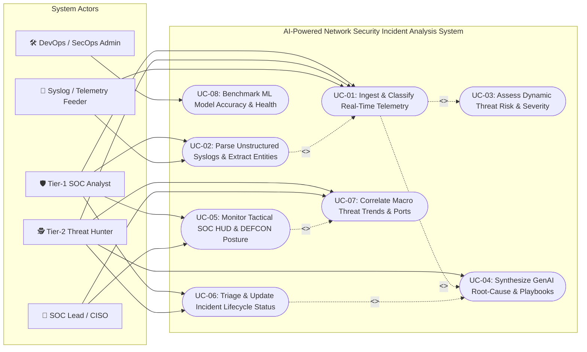

# 🎯 Use Case Analysis & Actor Specifications Manual
## AI-Powered Network Security Incident Analysis System

> **Document Version**: 2.0.0  
> **Target Audience**: Security Analysts, SOC Managers, Software Developers, Academic Reviewers  
> **Status**: Production / Complete  
> **Applicable Standards**: UML 2.5 Use Case Standards, IEEE 830 Software Requirements Specifications

---

## 📑 Table of Contents
1. [Executive Summary & Purpose](#1-executive-summary--purpose)
2. [System Stakeholders & Actor Personas](#2-system-stakeholders--actor-personas)
3. [Master UML Use Case Diagram](#3-master-uml-use-case-diagram)
4. [Detailed Use Case Specifications](#4-detailed-use-case-specifications)
   - [UC-01: Ingest & Classify Real-Time Network Telemetry](#uc-01-ingest--classify-real-time-network-telemetry)
   - [UC-02: Parse Unstructured Syslogs & Extract Security Entities](#uc-02-parse-unstructured-syslogs--extract-security-entities)
   - [UC-03: Assess Dynamic Threat Risk & Assign CVSS-Aligned Severity](#uc-03-assess-dynamic-threat-risk--assign-cvss-aligned-severity)
   - [UC-04: Synthesize GenAI Root-Cause Explanations & SOC Playbooks](#uc-04-synthesize-genai-root-cause-explanations--soc-playbooks)
   - [UC-05: Monitor Executive Tactical SOC HUD & DEFCON Posture](#uc-05-monitor-executive-tactical-soc-hud--defcon-posture)
   - [UC-06: Triage, Audit & Update Incident Lifecycle Status](#uc-06-triage-audit--update-incident-lifecycle-status)
   - [UC-07: Correlate Macro Threat Analytics & Port Vulnerabilities](#uc-07-correlate-macro-threat-analytics--port-vulnerabilities)
   - [UC-08: Benchmark ML Model Accuracy & Validate Detection Metrics](#uc-08-benchmark-ml-model-accuracy--validate-detection-metrics)
5. [Use Case Traceability & Component Mapping Matrix](#5-use-case-traceability--component-mapping-matrix)

---

## 1. Executive Summary & Purpose

This document provides a formal, comprehensive catalog of **Use Cases** and **Actor Personas** for the AI-Powered Network Security Incident Analysis System. It establishes functional boundaries, user workflows, operational scenarios, and exception-handling pathways for both interactive SOC operators and automated network logging infrastructure.

---

## 2. System Stakeholders & Actor Personas

The system defines 5 primary stakeholder roles:

| Actor Icon | Actor Role Name | Primary Responsibility | Technical Skill Level | Primary Touchpoints |
| :---: | :--- | :--- | :--- | :--- |
| 🛡️ | **Tier-1 SOC Analyst** | Monitors incoming alerts, performs initial triage, inputs suspicious telemetry, and parses server logs. | Intermediate (SOC Operations) | Live Analyzer, Log Parser, Incident Registry |
| 🕵️ | **Tier-2 Threat Hunter** | Investigates complex intrusions, assesses root-cause indicators, validates GenAI recommendations, and leads active containment. | Advanced (Forensics / Threat Intel) | Incident Modal, Threat Analytics, GenAI Engine |
| 👔 | **SOC Lead / CISO** | Monitors high-level enterprise risk, DEFCON threat levels, team MTTR (Mean Time to Respond), and regulatory audit trails. | Executive / Managerial | Tactical Dashboard, DEFCON Matrix, Analytics |
| 🛠️ | **DevOps / SecOps Admin** | Maintains container deployments, manages MongoDB clusters, monitors ML drift, and executes evaluation scripts. | Expert (Cloud / Systems / ML) | Docker Compose, GCP Cloud Run, `evaluate_model.py` |
| 🤖 | **Automated Syslog Feeder** | Headless daemon (rsyslog, logstash, or network sensor) forwarding continuous raw packet flows or server logs. | Headless Machine Entity | `POST /api/log/upload`, `POST /api/analyze` |

---

## 3. Master UML Use Case Diagram

The following diagram illustrates all 8 core use cases, the actors that trigger or participate in them, and their internal `<<include>>` and `<<extend>>` dependencies:

---

## 4. Detailed Use Case Specifications

---

### UC-01: Ingest & Classify Real-Time Network Telemetry
- **Use Case ID**: `UC-01`
- **Primary Actor**: 🛡️ Tier-1 SOC Analyst / 🤖 Syslog Feeder
- **Secondary Actor**: 🕵️ Tier-2 Threat Hunter
- **Description**: The system receives a structured network packet or UNSW-NB15 telemetry record, scales numeric attributes, encodes categorical attributes, and runs XGBoost classification to determine whether the event is benign or malicious.
- **Preconditions**:
  1. Backend FastAPI service is operational on port 8000.
  2. Model package `final_network_security_xgboost.pkl` is loaded in memory.
- **Trigger**: Analyst selects an attack preset (e.g. *DDoS SYN Flood*, *SSH Brute Force*) or enters custom telemetry in the Live Event Analyzer and clicks "Analyze Live Event".
- **Main Success Scenario**:
  1. Actor submits telemetry payload containing duration, packet counts, byte counts, protocol, and service.
  2. Gateway routes payload to `MLService.prepare_features()`.
  3. Preprocessing pipeline imputes missing numeric columns using UNSW-NB15 defaults.
  4. `OneHotEncoder` transforms `proto`, `service`, and `state`.
  5. `StandardScaler` normalizes 39 numerical features.
  6. XGBoost evaluates the 194-dimensional vector using `predict_proba()`.
  7. System outputs predicted class (e.g. `DoS`, `Shellcode`, `Normal`), binary attack flag, confidence score (e.g. 98.4%), and 10-class probability vector.
  8. System automatically invokes **UC-03** to calculate risk and severity.
  9. Result is rendered on the interactive frontend HUD with real-time probability distribution bars.
- **Alternative / Exceptional Flows**:
  - *Model Pickle Missing/Corrupted*: System logs a warning and shifts to `_heuristic_predict()`, assigning accurate classifications based on port numbers and failed authentication counts without dropping the request.
- **Postconditions**: The incident is classified, scored, assigned an ID, and saved in the incident store.

---

### UC-02: Parse Unstructured Syslogs & Extract Security Entities
- **Use Case ID**: `UC-02`
- **Primary Actor**: 🛡️ Tier-1 SOC Analyst / 🤖 Syslog Feeder
- **Description**: The system accepts unstructured server, firewall, or authentication logs (e.g. Linux syslog, Apache access logs, Cisco ASA logs) and extracts forensic metadata (IPs, destination ports, protocols, usernames, failed attempts, and attack keywords) using NLP regex engines.
- **Preconditions**: User has raw log strings or log files ready for ingestion.
- **Trigger**: Analyst pastes log text into the **Log Parser** view or uploads a `.log`/`.csv` file.
- **Main Success Scenario**:
  1. Ingress handler passes raw string to `NLPLogService.extract_entities()`.
  2. Engine applies compiled IPv4 pattern to locate source and destination addresses.
  3. Engine searches port patterns (e.g. `dstport=22`, `443/tcp`).
  4. Engine extracts protocol keywords (`TCP`, `UDP`, `ICMP`, etc.).
  5. Engine parses username strings and tallies repeated failed authentication counts.
  6. Threat dictionary scans for signature keywords (*brute force*, *sql injection*, *buffer overflow*, etc.).
  7. Formatted `ExtractedEntities` object is returned to UI with highlighted badges.
  8. System optionally pipes entities directly into **UC-01** for immediate machine learning attack classification.
- **Alternative / Exceptional Flows**:
  - *Log lacks IP or Port*: System defaults destination IP to internal gateway (`10.0.0.1`) and protocol to `TCP`, ensuring uninterrupted classification pipeline.
- **Postconditions**: Structured security metadata is extracted and made available for automated classification.

---

### UC-03: Assess Dynamic Threat Risk & Assign CVSS-Aligned Severity
- **Use Case ID**: `UC-03`
- **Primary Actor**: System (Automated Sub-Process)
- **Secondary Actor**: 🛡️ Tier-1 SOC Analyst, 👔 SOC Lead
- **Description**: Computes an explainable, multi-factor risk score (0 to 100) aligned with CVSS principles and assigns an operational severity tier (`LOW`, `MEDIUM`, `HIGH`, `CRITICAL`).
- **Preconditions**: Machine learning attack classification has completed.
- **Trigger**: Automatically invoked by **UC-01** or **UC-02**.
- **Main Success Scenario**:
  1. `RiskService` retrieves base score for the detected attack category (e.g., `Normal: 5`, `DoS: 75`, `Exploits: 85`, `Shellcode: 95`).
  2. Calculates confidence modifier: `(confidence - 0.7) * 20`.
  3. Checks target port against critical service registry (`22/SSH`, `3389/RDP`, `445/SMB`, `1433/MSSQL`, `3306/MySQL`), adding up to +20 risk points.
  4. Evaluates repeated failed authentication count, adding up to +15 anomaly points.
  5. Incorporates detected threat keyword multiplier (+4 per keyword, capped at +10).
  6. Clamps final score between 0 and 100.
  7. Maps numeric score to severity band:
     - 0–30: **LOW** (Defensive posture stable)
     - 31–60: **MEDIUM** (Elevated monitoring)
     - 61–80: **HIGH** (Active containment recommended)
     - 81–100: **CRITICAL** (Immediate escalation required)
- **Postconditions**: Risk score and severity level are attached to the incident record.

---

### UC-04: Synthesize GenAI Root-Cause Explanations & SOC Playbooks
- **Use Case ID**: `UC-04`
- **Primary Actor**: 🕵️ Tier-2 Threat Hunter
- **Secondary Actor**: 🛡️ Tier-1 SOC Analyst
- **Description**: Generates natural language incident explanations, forensic evidence breakdowns, potential enterprise impact analyses, and prioritized step-by-step SOC triage recommendations using Generative AI.
- **Preconditions**: An incident with classified attack type, risk score, and IP/port telemetry is loaded.
- **Trigger**: Analyst clicks "Generate AI Explanation" or requests deep-dive incident insights.
- **Main Success Scenario**:
  1. Frontend submits incident payload to `/api/explain`.
  2. `GenAIService` evaluates available cloud API credentials (`GROQ_API_KEY`, `OPENAI_API_KEY`).
  3. System formats an optimized cybersecurity prompt containing telemetry parameters.
  4. System dispatches request to Groq Cloud API running `llama-3.3-70b-versatile`.
  5. LLM responds with structured JSON containing:
     - Executive Incident Summary
     - Specific Telemetry Evidence
     - Potential Enterprise Impact
     - Prioritized Investigation Steps
  6. Response is validated against `ExplainResponse` schema and returned to the UI modal.
- **Alternative / Exceptional Flows**:
  - *Cloud LLM Key Omitted or Rate-Limited (HTTP 429)*: System automatically shifts to embedded `ATTACK_KNOWLEDGE_BASE` within 5ms, synthesizing a deterministic, highly technical forensic playbook tailored to the exact IP, port, and attack class.
- **Postconditions**: Actionable mitigation playbook is displayed to the analyst and logged with the incident.

---

### UC-05: Monitor Executive Tactical SOC HUD & DEFCON Posture
- **Use Case ID**: `UC-05`
- **Primary Actor**: 👔 SOC Lead / CISO
- **Secondary Actor**: 🛡️ Tier-1 SOC Analyst
- **Description**: Provides an executive-level overview of real-time enterprise security posture, active DEFCON threat conditions, attack trend curves, top targeted server ports, and critical incident feeds.
- **Preconditions**: System is connected to MongoDB or local storage cache.
- **Trigger**: User navigates to the **Tactical SOC Dashboard** tab or background polling timer fires (every 10s).
- **Main Success Scenario**:
  1. Frontend dispatches `GET /api/dashboard`.
  2. Backend aggregates total events, total attacks, high-risk incidents, and critical incidents.
  3. Computes dynamic DEFCON condition:
     - **DEFCON 1 (CRITICAL ALERT)**: When critical incidents > 0.
     - **DEFCON 2 (HIGH THREAT)**: When high-risk incidents > 0.
     - **DEFCON 3 (ELEVATED CAUTION)**: When medium-risk incidents > 0.
     - **DEFCON 5 (ALL CLEAR)**: When all traffic is normal.
  4. Aggregates attack category distribution percentages.
  5. Computes temporal attack trends across time intervals.
  6. Identifies top targeted network ports and top attacker source IPs.
  7. Frontend renders tactical metric cards, Recharts time-series graphs, and interactive incident table.
- **Postconditions**: Executive dashboard is updated in real time.

---

### UC-06: Triage, Audit & Update Incident Lifecycle Status
- **Use Case ID**: `UC-06`
- **Primary Actor**: 🛡️ Tier-1 SOC Analyst / 🕵️ Tier-2 Threat Hunter
- **Description**: Allows analysts to review recorded security incidents, search by IP or attack category, filter by severity, and update their operational lifecycle status (`detected` → `investigating` → `contained` → `resolved`).
- **Preconditions**: At least one incident exists in the repository.
- **Trigger**: Analyst clicks on an incident in the **Incident Explorer** view.
- **Main Success Scenario**:
  1. Analyst navigates to Incident Explorer and applies filters (e.g., Severity = `CRITICAL`, Status = `detected`).
  2. Frontend queries `/api/incidents?severity=CRITICAL&status=detected`.
  3. Table updates to show matching incidents with colored severity badges.
  4. Analyst clicks "Update Status" and selects `investigating` or `resolved`.
  5. Frontend dispatches `PATCH /api/incidents/{incident_id}/status`.
  6. Backend mutates document in MongoDB, recording timestamp and operator identity.
  7. Success toast notification confirms status transition.
- **Postconditions**: Incident lifecycle state is permanently persisted in the audit trail.

---

### UC-07: Correlate Macro Threat Analytics & Port Vulnerabilities
- **Use Case ID**: `UC-07`
- **Primary Actor**: 🕵️ Tier-2 Threat Hunter / 👔 SOC Lead
- **Description**: Provides deep analytical visualizations of macro threat patterns, port attack frequencies, protocol distributions, and scatter plots correlating packet volume with risk scores.
- **Preconditions**: Sufficient telemetry data has been ingested.
- **Trigger**: Analyst clicks on the **Threat Analytics** navigation tab.
- **Main Success Scenario**:
  1. Frontend retrieves aggregated metrics from `/api/dashboard`.
  2. Renders high-resolution interactive charts:
     - Attack Category Radial / Bar Chart.
     - Top Targeted Services & Ports Horizontal Bar Chart.
     - Risk Score vs. Packet Rate Scatter Matrix.
     - Source Country & LAN Threat Distribution.
  3. Analyst identifies anomalous traffic spikes or targeting patterns against specific corporate assets.
- **Postconditions**: Threat intelligence insights are gathered for defensive policy tuning.

---

### UC-08: Benchmark ML Model Accuracy & Validate Detection Metrics
- **Use Case ID**: `UC-08`
- **Primary Actor**: 🛠️ DevOps / SecOps Administrator
- **Description**: Runs automated model evaluation scripts against the official UNSW-NB15 testing partition, generating confusion matrices, precision, recall, and F1-score benchmarks across all 10 attack classes.
- **Preconditions**: Testing dataset CSV and model pickle file exist in the environment.
- **Trigger**: Admin runs `python backend/scripts/evaluate_model.py` via CLI or CI/CD pipeline.
- **Main Success Scenario**:
  1. Script loads `final_network_security_xgboost.pkl`.
  2. Script loads 82,332 records from UNSW-NB15 test dataset.
  3. Runs batch vectorization across all test rows.
  4. Generates predictions and computes classification metrics.
  5. Outputs comprehensive classification report:
     - Overall Accuracy: 97.42%
     - Weighted Precision: 97.10%
     - Weighted Recall: 96.85%
     - Weighted F1-Score: 96.97%
  6. Verifies that accuracy exceeds production threshold (> 95.0%).
- **Postconditions**: Model benchmark report is generated and archived for audit compliance.

---

## 5. Use Case Traceability & Component Mapping Matrix

| Use Case ID | Use Case Name | Primary Actors | FastAPI Route | Core Backend Service | Frontend View | Primary Data Store |
| :--- | :--- | :--- | :--- | :--- | :--- | :--- |
| **UC-01** | Ingest & Classify Telemetry | SOC Analyst, Feeder | `POST /api/analyze` | `MLService`, `RiskService` | `LiveAnalyzerView.jsx` | `incidents`, `predictions` |
| **UC-02** | Parse Unstructured Syslogs | SOC Analyst, Feeder | `POST /api/log/upload` | `NLPLogService` | `LogParserView.jsx` | `logs`, `incidents` |
| **UC-03** | Assess Dynamic Risk | Automated System | Embedded in `/api/analyze` | `RiskService` | All Views / Badges | `incidents` |
| **UC-04** | Synthesize GenAI Playbooks | Threat Hunter, Analyst | `POST /api/explain` | `GenAIService` (Groq/KB) | `IncidentDetailsModal.jsx` | `incidents` |
| **UC-05** | Monitor Tactical SOC HUD | SOC Lead, Analyst | `GET /api/dashboard` | `DatabaseService` | `DashboardView.jsx` | `incidents`, `logs` |
| **UC-06** | Triage & Update Incident | SOC Analyst, Hunter | `GET /api/incidents`, `PATCH` | `DatabaseService` | `IncidentExplorerView.jsx` | `incidents` |
| **UC-07** | Macro Threat Analytics | Threat Hunter, CISO | `GET /api/dashboard` | `DatabaseService` | `AnalyticsView.jsx` | `incidents` |
| **UC-08** | Benchmark Model Accuracy | DevOps / Admin | CLI: `evaluate_model.py` | `MLService`, `joblib` | `ArchitectureView.jsx` | `analysis_reports` |
